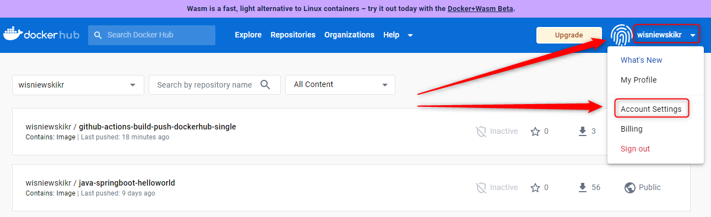
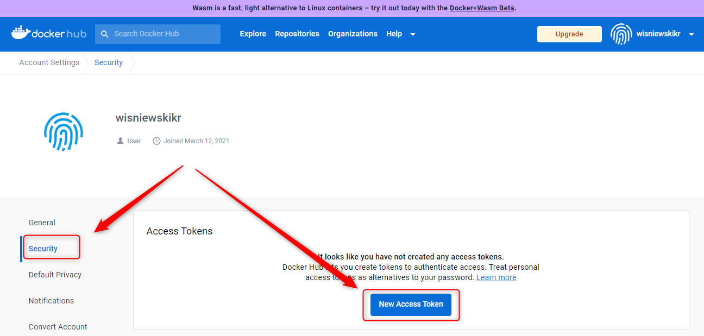
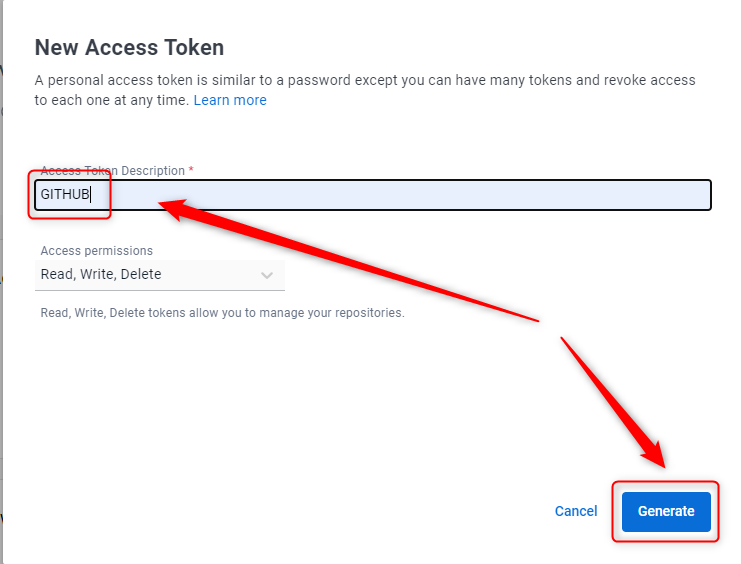
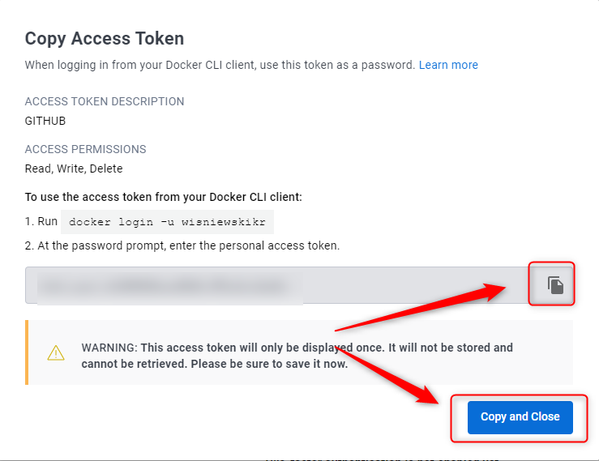
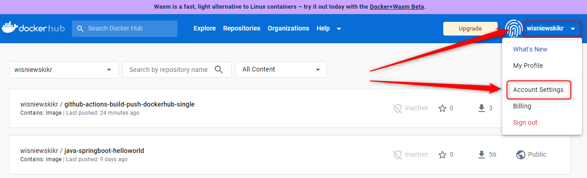
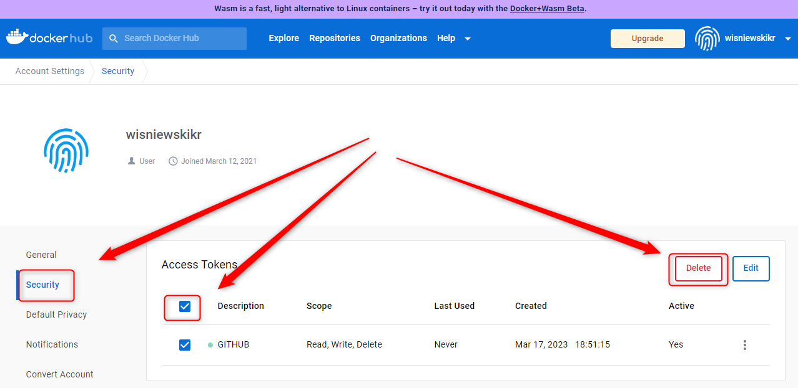
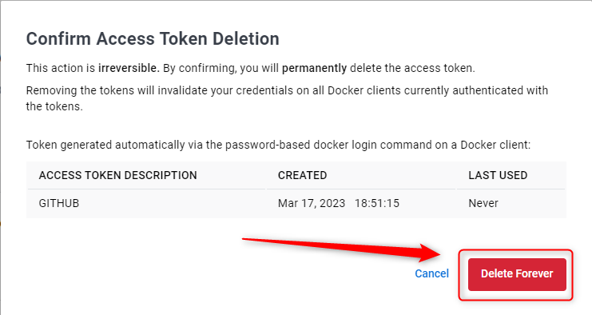
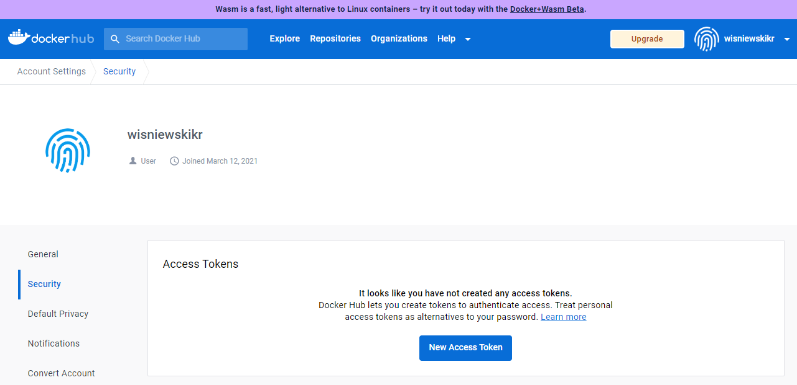

USAGE
-----

> **NOTE** This usage assumes that user possesses **Dockerhub Account**

Steps:
1. Create Dockerhub Access Token. Please check section **CREATE ACCESS TOKEN**
1. Delete Dockerhub Access Token. Please check section **DELETE ACCESS TOKEN**

DESCRIPTION
-----------

##### Goal
The goal of this project is to present how to create Access Token in Dockerhub.

##### Terminology
Terminology explanation:
* **Dockerhub**: it's platform for storing Docker Images

##### Flow
The following flow takes place in this project:
1. User creates Access Token in Dockerhub
1. User deletes Access Token in Dockerhub

##### Launch
To launch this application please make sure that the **Preconditions** are met and then follow instructions from **Usage** section.

##### Technologies
This project uses following technologies:
* N/A

PRECONDITIONS
-------------

##### Preconditions - Tools
* Installed **Operating System** (tested on Windows 10)

##### Preconditions - Actions
* Created **Dockerhub Account**

CREATE ACCESS TOKEN
-------------------

Link:
* https://console.cloud.google.com/

DELETE ACCESS TOKEN
-------------------

Link:
* https://console.cloud.google.com/

