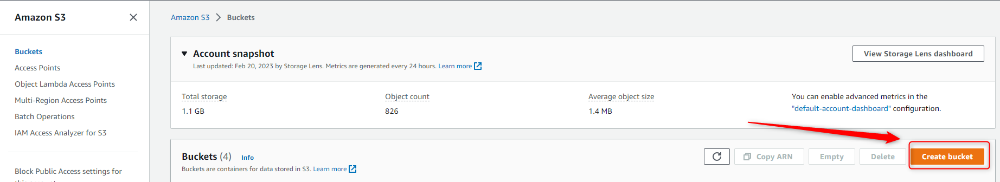
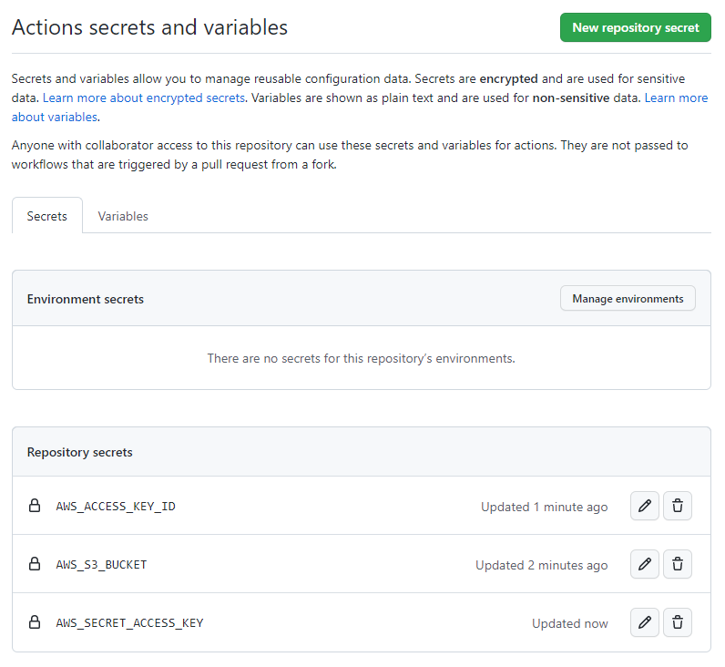

USAGE
-----

Steps:
1. Configure AWS IAM. Please check section **CONFIGURATION AIM**
1. Configure AWS S3. Please check section **CONFIGURATION S3**
1. Configure Github Actions. Please check section **CONFIGURATION GITHUB ACTIONS**


DESCRIPTION
-----------

##### Goal
The goal of this project is to present how to configure **Github Actions** with **AWS S3**. On every push to GIT content should be also pushed to AWS S3.

##### Technologies
This project uses following technologies:
* **Git**: `https://docs.google.com/document/d/1Iyxy5DYfsrEZK5fxZJnYy5a1saARxd5LyMEscJKSHn0/edit?usp=sharing`
* **AWS**


PRECONDITIONS
-------------

##### Preconditions - Tools

##### Preconditions - Actions
* Created AWS account 
* Created IAM user with EC2 permissions. Please check section **CREATE IAM USER**


CONFIGURE AIM
-------------

AWS Console:
* https://console.aws.amazon.com/


CONFIGURE S3
-------------

AWS Console:
* https://console.aws.amazon.com/





CONFIGURE GITHUB
----------------

Link:
* https://www.github.com

```
name: Upload To S3

on:
  push:
    branches:
    - master

jobs:
  deploy:
    runs-on: ubuntu-latest
    steps:
    - uses: actions/checkout@master
    - uses: jakejarvis/s3-sync-action@master
      with:
        args: --acl public-read --follow-symlinks --delete --exclude '.git*/*'
      env:
        AWS_S3_BUCKET: ${{ secrets.AWS_S3_BUCKET }}
        AWS_ACCESS_KEY_ID: ${{ secrets.AWS_ACCESS_KEY_ID }}
        AWS_SECRET_ACCESS_KEY: ${{ secrets.AWS_SECRET_ACCESS_KEY }}
```





