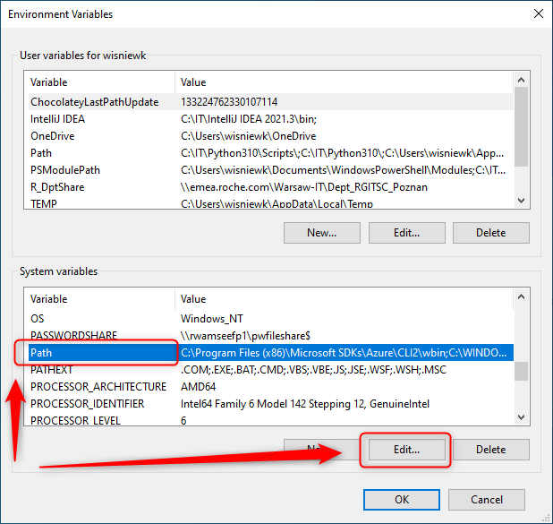

USAGE
-----

Steps:
1. Install Terraform. Please check section **INSTALL TERRAFORM**

DESCRIPTION
-----------

##### Goal
The goal of this project is to present how to install **Terraform**.

##### Terminology
Terminology explanation:
* **Terraform**: it's a tool for creating and managing Cloud infrastructure.

##### Flow
The following flow takes place in this project:
1. User installs Terraform

##### Launch
To launch this application please make sure that the **Preconditions** are met and then follow instructions from **Usage** section.

##### Technologies
This project uses following technologies:
* **Terraform**: `https://docs.google.com/document/d/1GdF9nnI4GWZce6d_8K7Xl5Ffi4VGgSxTEDV-BCjQRk4/edit?usp=sharing`

PRECONDITIONS
-------------

##### Preconditions - Tools
* Installed **Operating System** (tested on Windows 10)

##### Preconditions - Actions
* N/A

INSTALL TERRAFORM
-----------------

Link:
* `https://terraform.io`

